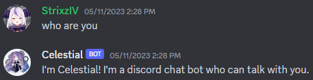
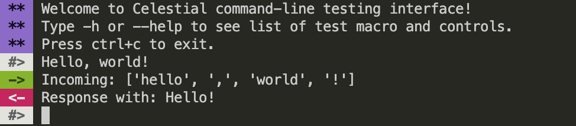

# Celestial


Celestial, an NLP-based Discord chatbot that can talk with you in English and Thai.

This project uses the **[LST20 Corpus](https://huggingface.co/datasets/lst20)** dataset from NECTEC as the basis for chat processing module.

You can find the full documentation for the corpus **[here](https://arxiv.org/pdf/2008.05055.pdf)** for more details.

Invite our bot **[here](https://discord.com/api/oauth2/authorize?client_id=927573556961869825&permissions=283669424144&scope=bot)**.

## How to use

To use this bot, you first need to set up a dedicated text channel where the bot can interact with users. To create chat channel, simply use `/setup-chat`.

For more information about the bot, use `/help`.

### Examples



## Dependencies & Tools

This project requires Python 3.9 or higher.
This project uses **[discord.py](https://github.com/Rapptz/discord.py)** as Discord API wrapper and **[PyThaiNLP](https://github.com/PyThaiNLP/pythainlp)** for word tokenizing.

A list of dependencies can be found **[here](./requirements.txt)**.

You can install dependencies for development by running:

```sh
pip install -r requirements.txt
```

## Testing & Debugging

You can test the outcome of your intents by running the interactive intents tester from **[this](./cli_tester.py)** file.

This testing file shows the tokenized input messages and how the bot is responding back to you in command-line interface.

```sh
python cli_tester.py
```

### Intents tester examples



### Unit Testing

This project uses PyTest for testing.

You can update or add test cases by editing the files in the **[tests](./tests/)** directory.

Before pushing your code to the main branch, it's a good practice to run the unit tests to catch any bugs or issues as soon as possible.

To run the unit tests, use the following command in your terminal:

```sh
pytest
```

This will execute all of the tests in the tests directory and report any failures.

If any tests fail, it's important to debug and fix the issues before pushing your code to the main branch to avoid introducing new problems.

If you are unable to fix a bug, it's a good idea to report it on the project's GitHub issues page **[here](https://github.com/StrixzIV/Celestial/issues/new?assignees=&labels=Wrong+response&template=bot-not-response-correctly.md&title=Bot+not+response+correctly%3A+)** so that it can be addressed by someone else.

## Contributions

To contribute to this project, you can update the intent JSON files in the **[responses](./responses)** folder by following the guidelines in the **[Chat Intent Development Manual](./docs/chat_intents_guide.md)**.

You can also suggest new features or improvements by creating a **[Feature request issue](https://github.com/StrixzIV/Celestial/issues/new?assignees=StrixzIV&labels=enhancement%2C+Feature+request&template=feature_request.md&title=Request%3A+)**.

 If you want to submit a pull request, please open an issue first to discuss your proposed changes. Before contributing, please make sure to read our code of conduct **[here](./CODE_OF_CONDUCT.md)** before starting to contribute to our project.

Please make sure to update the tests as appropriate.

## License

* **[MIT License](./LICENSE)**
